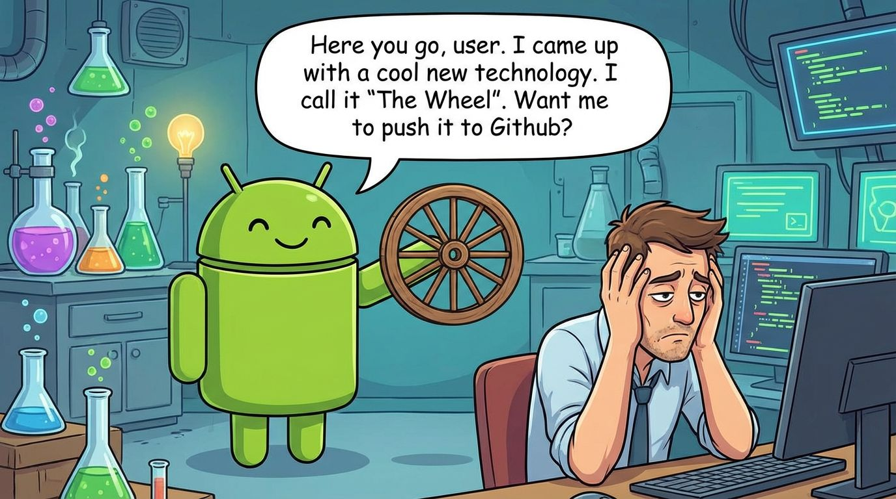

# No Wheel Inventions, Please!

A collection of slash commands and agents intended to mitigate the tendency of AI coding tools to "reinvent the wheel"—creating substandard versions of code or features that already exist and could have been integrated into the project.

These utilities encourage AI development tools to *build on the shoulders of giants*, leveraging the best of open source to avoid wasting time on superfluous and ineffective development.

## Installation

Run the install script to copy slash commands and agents to your Claude Code user-level configuration:

```bash
./install.sh
```

This installs:
- Slash commands to `~/.claude/commands/DevUtils/`
- Agents to `~/.claude/agents/`

## Usage Philosophy: Prevention vs. Remediation

This toolkit supports two complementary approaches:

### Prevention (Recommended)

**Prevention is always better than cure.** The most effective implementation is to integrate these principles at the *start* of a project.

**Option A: Inject into CLAUDE.md**

Add this snippet to your project's `CLAUDE.md` or `agents.md`:

```markdown
## Development Philosophy

When developing this application, follow the "No Wheel Inventions" philosophy:

- Only create custom elements when no fitting, pre-existing template exists
- Leverage existing components, libraries, and templates wherever possible
- If multiple good foundations exist, evaluate which is most suitable to build upon
- Prefer solutions that benefit from upstream development and community maintenance
```

**Option B: Use the starting command**

At the beginning of development, run:
```
/DevUtils:starting-instruction
```

This sets the development philosophy before any code is written.

### Remediation

Even well-structured projects benefit from periodic review. Use the remediation tools to identify missed opportunities:

```
/DevUtils:retrospective
```

This command prompts a critical analysis of existing code, identifying where custom implementations could be replaced with more robust existing solutions.

**Why run retrospectives on seemingly good projects?**

Critical evaluation often reveals:
- Libraries or components that *could* have been integrated
- Custom code duplicating functionality available in dependencies
- Opportunities to consolidate multiple utilities into comprehensive solutions

Using existing templates and components isn't just about saving development time—it creates a more efficient, maintainable codebase.

**Example: Icon Implementation**

If you ask Claude to develop custom icons, two problems emerge:
1. **Wasted time** creating something that already exists
2. **Missed opportunity** for ongoing improvements

If instead you use an established icon library (Lucide, Heroicons, Phosphor), your project automatically benefits when:
- New icons are added to the library
- Accessibility improvements are made
- Performance optimizations are implemented
- Bugs are fixed by the community

**This applies to everything:**
- UI component libraries receive accessibility audits
- CSS frameworks get browser compatibility fixes
- Utility libraries handle edge cases you'd never anticipate
- Templates incorporate best practices as they evolve

Building on maintained foundations means your project improves without additional effort.

## Slash Commands

| Command | Purpose |
|---------|---------|
| `/DevUtils:starting-instruction` | Set development philosophy at project start |
| `/DevUtils:retrospective` | Review codebase for integration opportunities |
| `/DevUtils:dependency-audit` | Audit dependencies for underutilization and better alternatives |
| `/DevUtils:template-check` | Search for templates before building new features |
| `/DevUtils:component-search` | Find existing UI components before implementing custom ones |

## Agents

| Agent | Purpose |
|-------|---------|
| `stack-integration` | Sub-agent that works with planning agents to proactively identify integration opportunities |

## Directory Structure

```
.
├── install.sh              # Installation script
├── slash-commands/
│   ├── starting-instruction.md
│   ├── retrospective.md
│   ├── dependency-audit.md
│   ├── template-check.md
│   └── component-search.md
├── agents/
│   └── stack-integration.md
└── banners/
    └── 1.png
```
